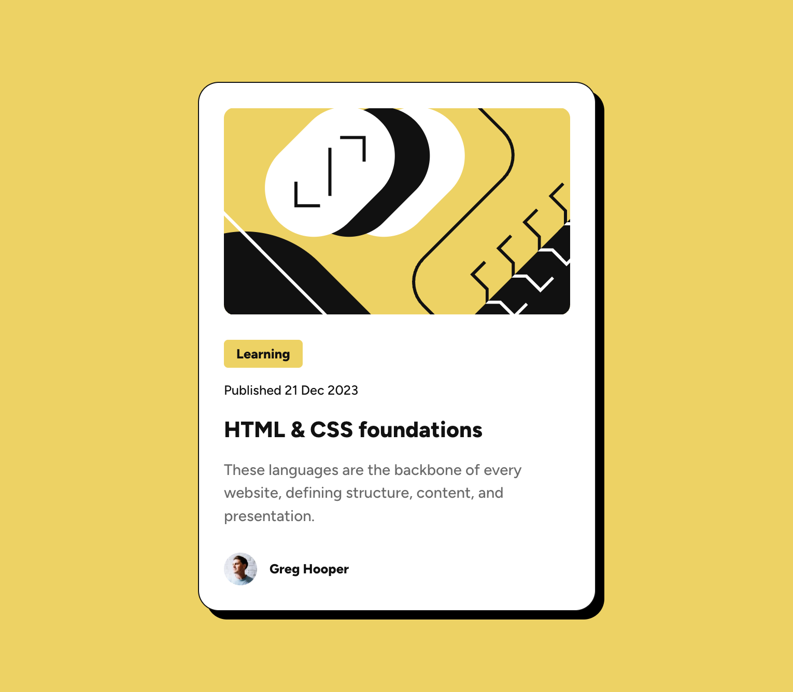

# Frontend Mentor - Blog preview card solution

This is a solution to the [Blog preview card challenge on Frontend Mentor](https://www.frontendmentor.io/challenges/blog-preview-card-ckPaj01IcS). Frontend Mentor challenges help you improve your coding skills by building realistic projects.

## Table of contents

- [Overview](#overview)
  - [Screenshot](#screenshot)
  - [Links](#links)
- [My process](#my-process)
  - [Built with](#built-with)
  - [What I learned](#what-i-learned)
  - [Continued development](#continued-development)
  - [Useful resources](#useful-resources)
- [Author](#author)
- [Acknowledgments](#acknowledgments)

## Overview

### Screenshot



### Links

- Solution URL - [https://github.com/vlrnsnk/blog-preview-card](https://github.com/vlrnsnk/blog-preview-card)
- Live Site URL - [https://vlrnsnk.github.io/blog-preview-card/](https://vlrnsnk.github.io/blog-preview-card/)

## My process

### Built with

- Semantic HTML5 markup
- SCSS with CSS custom properties
- Flexbox
- Mobile-first workflow
- Gulp for task automation (build, styles, images)
- [Stylelint](https://stylelint.io/) for CSS linting and code quality
- [gh-pages](https://www.npmjs.com/package/gh-pages) for deployment

### What I learned

- How to implement **hover state** with SCSS and maintain accessibility
- Implement **reduced motion** for users who prefer minimal animation
- How to organize SCSS files conceptually (abstracts, base, components, layout, pages, themes, vendors)

Example SCSS snippet with modern accessibility considerations:

```scss
.card {
  &__title {
    transition: color 0.2s ease-in-out;

    &:hover {
      color: abstracts.$color-yellow;
      cursor: pointer;
    }

    @media (prefers-reduced-motion: reduce) {
      transition: none;
    }
  }
}
```

### Continued development

- Implement a conceptual CSS property ordering system to improve readability and maintainability

- Explore more accessible design patterns for focus and hover states

- Add CSS logical properties for internationalization support

- Refactor Gulp tasks for better error handling and image optimization

### Useful resources

- Original challenge reference - [Frontend Mentor Blog Preview Card Challenge](https://www.frontendmentor.io/challenges/blog-preview-card-ckPaj01IcS)

- For understanding smooth transitions - [MDN CSS Transitions](https://developer.mozilla.org/en-US/docs/Web/CSS/transition)

- For modern CSS linting rules - [Stylelint documentation](https://stylelint.io/)

- Accessibility guidance for animations - [Prefers-Reduced-Motion](https://developer.mozilla.org/en-US/docs/Web/CSS/@media/prefers-reduced-motion)

## Author

- Website - [Valeriy Anysenko](https://vlrnsnk.com)
- Frontend Mentor - [@vlrnsnk](https://www.frontendmentor.io/profile/vlrnsnk)
- GitHub - [@vlrnsnk](https://github.com/vlrnsnk)

## Acknowledgments

- Inspired by Frontend Mentor’s challenge structure and best practices
- Stylelint and SCSS community for accessible and maintainable CSS patterns
